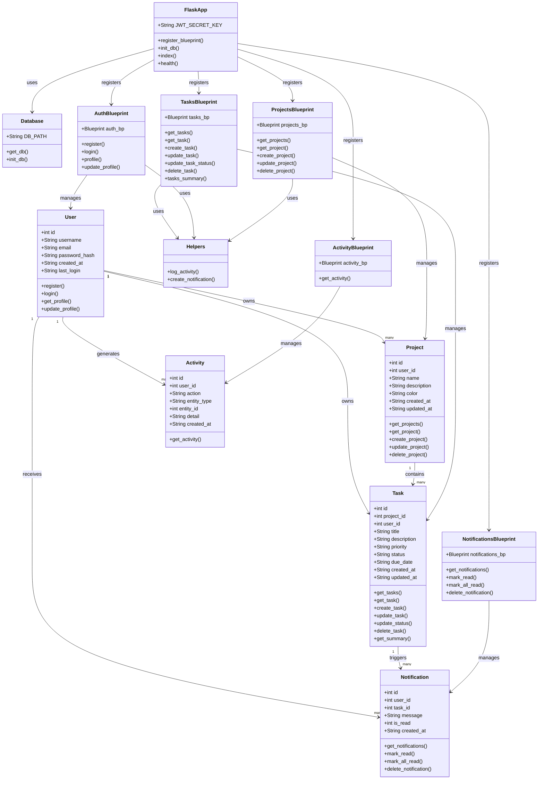

# TaskMaster UML Class Diagram

```mermaid
classDiagram
    class User {
        +int id
        +String username
        +String email
        +String password_hash
        +String created_at
        +String last_login
        +register()
        +login()
        +get_profile()
        +update_profile()
    }

    class Project {
        +int id
        +int user_id
        +String name
        +String description
        +String color
        +String created_at
        +String updated_at
        +get_projects()
        +get_project()
        +create_project()
        +update_project()
        +delete_project()
    }

    class Task {
        +int id
        +int project_id
        +int user_id
        +String title
        +String description
        +String priority
        +String status
        +String due_date
        +String created_at
        +String updated_at
        +get_tasks()
        +get_task()
        +create_task()
        +update_task()
        +update_status()
        +delete_task()
        +get_summary()
    }

    class Notification {
        +int id
        +int user_id
        +int task_id
        +String message
        +int is_read
        +String created_at
        +get_notifications()
        +mark_read()
        +mark_all_read()
        +delete_notification()
    }

    class Activity {
        +int id
        +int user_id
        +String action
        +String entity_type
        +int entity_id
        +String detail
        +String created_at
        +get_activity()
    }

    class Database {
        +String DB_PATH
        +get_db()
        +init_db()
    }

    class Helpers {
        +log_activity()
        +create_notification()
    }

    class AuthBlueprint {
        +Blueprint auth_bp
        +register()
        +login()
        +profile()
        +update_profile()
    }

    class TasksBlueprint {
        +Blueprint tasks_bp
        +get_tasks()
        +get_task()
        +create_task()
        +update_task()
        +update_task_status()
        +delete_task()
        +tasks_summary()
    }

    class ProjectsBlueprint {
        +Blueprint projects_bp
        +get_projects()
        +get_project()
        +create_project()
        +update_project()
        +delete_project()
    }

    class NotificationsBlueprint {
        +Blueprint notifications_bp
        +get_notifications()
        +mark_read()
        +mark_all_read()
        +delete_notification()
    }

    class ActivityBlueprint {
        +Blueprint activity_bp
        +get_activity()
    }

    class FlaskApp {
        +String JWT_SECRET_KEY
        +register_blueprint()
        +init_db()
        +index()
        +health()
    }

    User "1" --> "many" Project : owns
    User "1" --> "many" Task : owns
    User "1" --> "many" Notification : receives
    User "1" --> "many" Activity : generates
    Project "1" --> "many" Task : contains
    Task "1" --> "many" Notification : triggers

    FlaskApp --> AuthBlueprint : registers
    FlaskApp --> TasksBlueprint : registers
    FlaskApp --> ProjectsBlueprint : registers
    FlaskApp --> NotificationsBlueprint : registers
    FlaskApp --> ActivityBlueprint : registers
    FlaskApp --> Database : uses

    AuthBlueprint --> User : manages
    TasksBlueprint --> Task : manages
    ProjectsBlueprint --> Project : manages
    NotificationsBlueprint --> Notification : manages
    ActivityBlueprint --> Activity : manages

    TasksBlueprint --> Helpers : uses
    AuthBlueprint --> Helpers : uses
    ProjectsBlueprint --> Helpers : uses
```
