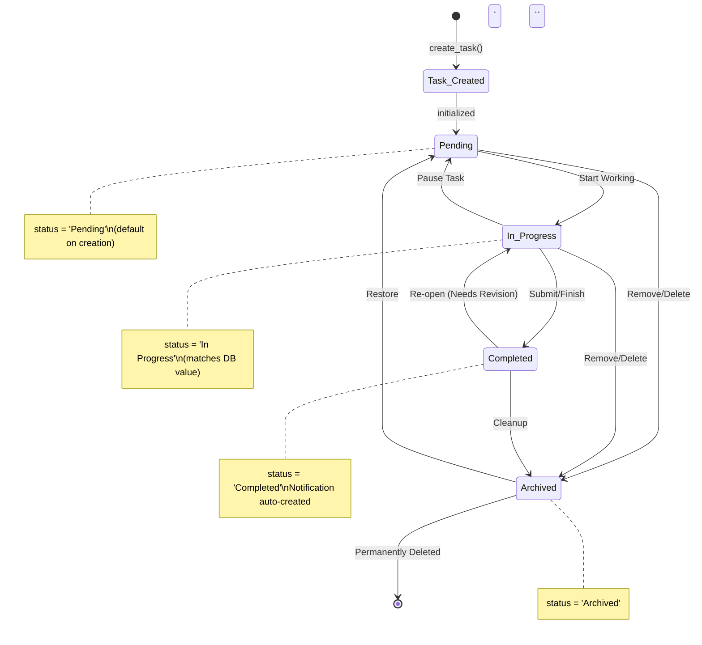

# TaskMaster Statechart Diagram

This tracks how a task moves through its lifecycle in the system.

## Task Lifecycle Statechart



## How to update:
1. Open `docs/statechart_diagram.md` in VS Code
2. Select all (`Cmd + A`) and delete
3. Paste the code above
4. Save (`Cmd + S`)
5. Then push:
```bash
git add docs/statechart_diagram.md
git commit -m "Update statechart to match actual backend status values"
git push origin main
```
